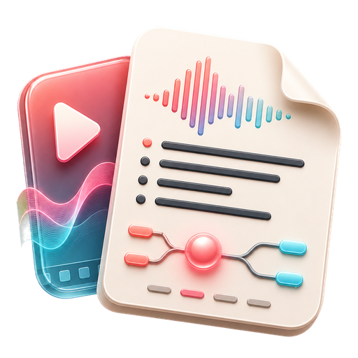

# BiNote · B站 AI 笔记助手

> 一键把 B站视频转成可搜索、可总结的结构化笔记。Tauri 2 + Rust + React 实现，**Windows / macOS / Android** 三端同源。

<p align="center">
  
</p>

<p align="center">
  <a href="https://github.com/yyyzl/bilinote/releases/latest"></a>
  <a href="https://github.com/yyyzl/bilinote/actions/workflows/release.yml"></a>
  
  
  
</p>

---

## ✨ 功能特性

- 🎬 **全格式 B站链接解析** —— `b23.tv` 短链、`BVxxx`、`av123456`、完整 URL 都能直接粘贴
- 🎙️ **双 ASR 引擎可选** —— 阿里云 DashScope `qwen3-asr-flash` 或硅基流动 SenseVoiceSmall
- 🔐 **B站扫码登录** —— RSA-OAEP 加密 + Cookie 自动刷新，1080P / 大会员视频也能转
- 🤖 **任意 OpenAI 兼容 LLM** —— 默认 `gpt-4o-mini`，也可接 Claude / DeepSeek / Qwen / Kimi 等
- 💾 **本地优先** —— 配置和笔记都存在本地 app data 目录，不经第三方服务器
- 📱 **桌面 / 移动同源** —— 同一份 Rust 代码同时跑 Windows、macOS、Android
- 🎨 **编辑/杂志风纸感 UI** —— 暖橙赤陶主色 `#b75d3e`，米白纸感底，Manrope 正文 + Newsreader 衬线大标题，整体接近 Claude.ai 的视觉语言
- 🧹 **临时音频自动清理** —— 转录完成立即删除

---

## 📦 下载

所有产物在 [**Releases**](https://github.com/yyyzl/bilinote/releases/latest) 页面，由 GitHub Actions 自动构建。

| 平台 | 产物 | 说明 |
|------|------|------|
| **Windows** | `BiNote_<version>_x64-setup.exe` / `.msi` | x86_64，NSIS 安装器 + MSI |
| **macOS** | `BiNote_<version>_universal.dmg` | Apple Silicon + Intel universal，最低 macOS 10.15 |
| **Android** | `BiNote-arm64-release-signed.apk` | arm64-v8a，**CI 临时 debug 密钥签名**（可正常安装，未上架商店） |

> Android APK 在 CI 上用临时 debug keystore 签名。需要正式发布签名时请参考下方 [Android 正式签名](#android-正式签名)。

---

## 🚀 快速开始

### 前置要求

| 工具 | 版本 |
|------|------|
| Node.js | ≥ 18 |
| Rust | ≥ 1.70（stable） |
| 平台依赖 | Windows: WebView2；macOS: Xcode CLT；Android: JDK 17 + Android SDK + NDK |

### 开发模式

```bash
cd binote
npm install
npm run tauri dev
```

### 桌面端打包

```bash
cd binote
npm run tauri build
```

产物位置：

- Windows: `binote/src-tauri/target/release/bundle/{nsis,msi}/`
- macOS: `binote/src-tauri/target/universal-apple-darwin/release/bundle/{macos,dmg}/`
- Linux: `binote/src-tauri/target/release/bundle/{appimage,deb,rpm}/`

### macOS 打包

`.app` / `.dmg` 必须在 macOS 上构建：

```bash
cd binote
bash build-macos.sh
```

未配置 Apple Developer 证书时默认产**未签名包**，首次打开需在「隐私与安全性」里手动允许。需要签名 + 公证时改用 `npm run mac:build:signed`，并在 macOS 上配好证书。

### Android 打包

Windows 上由于符号链接限制，需用专用脚本：

```bash
cd binote
bash build-android.sh
```

脚本会依次：编译 Rust（aarch64-linux-android）→ 同步 Android 图标 → 拷贝 `.so` 到 `jniLibs` → Gradle 构建 → zipalign 对齐 → apksigner 签名。

最终产物：`binote/BiNote-arm64-release-signed.apk`。

> 该脚本默认使用本机 `~/.android/debug.keystore`，仅供本地开发调试。

---

## ⚙️ 配置 API

首次启动 → 右上角 **设置**：

| 字段 | 含义 |
|------|------|
| ASR Provider | `dashscope`（阿里云）或 `sensevoice`（硅基流动） |
| ASR API Key | 对应服务商的 API Key |
| LLM Base URL | 默认 `https://api.openai.com/v1`，可指向任意 OpenAI 兼容端点 |
| LLM API Key | LLM 服务的 Key |
| LLM Model | 默认 `gpt-4o-mini`，可换 `claude-sonnet-4-5`、`deepseek-chat`、`qwen-plus` 等 |
| B站登录 | 在设置页扫码登录，登录后可转 1080P / 大会员视频 |

配置存放位置（不经任何第三方）：

- Windows: `%APPDATA%\com.binote.app\config.json`
- macOS: `~/Library/Application Support/com.binote.app/config.json`
- Android: `/data/data/com.binote.app/files/config.json`

---

## 🏗️ 架构

```
binote/
├── src/                          # React 前端
│   ├── pages/
│   │   ├── Dashboard.tsx         # 笔记列表 + 链接输入
│   │   ├── Settings.tsx          # 配置 + 扫码登录
│   │   └── NoteDetail.tsx        # 转录稿 + AI 总结
│   └── lib/tauri.ts              # invoke / event 封装
└── src-tauri/                    # Rust 后端
    └── src/
        ├── main.rs               # 入口
        ├── commands.rs           # Tauri command 处理器
        ├── bilibili.rs           # B站 API（视频信息、音频下载）
        ├── auth.rs               # 扫码登录 + Cookie 刷新
        ├── asr/                  # ASR 抽象 + 两种实现
        │   ├── mod.rs
        │   ├── dashscope.rs
        │   ├── sensevoice.rs
        │   └── utils.rs
        ├── llm.rs                # OpenAI 兼容 LLM 客户端
        ├── store.rs              # JSON 持久化
        └── error.rs              # AppError
```

**Tauri Commands**: `get_config` / `save_config` / `get_notes` / `get_note` / `delete_note` / `parse_link` / `get_video_info` / `transcribe` / `summarize` / `qrcode_generate` / `qrcode_poll` / `get_login_status` / `logout_bilibili`

**事件**: `transcribe:progress`、`summarize:progress` 实时推进度到前端。

---

## 🤖 GitHub Actions

| Workflow | 触发 | 作用 |
|----------|------|------|
| `.github/workflows/release.yml` | 推 tag `v*` 或手动 | 并行打 Win / macOS / Android，自动建 GitHub Release |
| `.github/workflows/ci.yml` | PR / push 到 `main` | 前端构建 + Rust `cargo check`，快速回归检查 |

### 发版流程

```bash
# 1. 提交所有改动
git commit -am "feat: ..."

# 2. 打 tag 推上去，CI 会自动跑三平台 build 并发 Release
git tag v0.1.1
git push origin v0.1.1
```

CI 跑完后，[Releases](https://github.com/yyyzl/bilinote/releases) 页面会出现新版本，三平台产物全部附在 release assets。

### 手动触发（不打 tag）

Actions 页面 → `Release Build` → `Run workflow` → 选要构建的平台（默认全选）。产物会作为 artifact 上传，**不会**建 GitHub Release。

### Android 正式签名

CI 默认用临时 debug keystore，能装能用，但**不能上架**。要用正式 release keystore：

1. 本地生成 keystore：
   ```bash
   keytool -genkey -v -keystore release.keystore -alias binote -keyalg RSA -keysize 2048 -validity 10000
   ```
2. 把 keystore 转 base64：
   ```bash
   base64 -w0 release.keystore > release.keystore.b64
   ```
3. 在 GitHub 仓库 → Settings → Secrets and variables → Actions 添加 4 个 secret：
   - `ANDROID_KEYSTORE_BASE64` — `release.keystore.b64` 的内容
   - `ANDROID_KEYSTORE_PASSWORD`
   - `ANDROID_KEY_ALIAS` — 例如 `binote`
   - `ANDROID_KEY_PASSWORD`
4. CI 检测到 secret 后会自动切换到正式签名（已在 workflow 里写好兜底逻辑）。

---

## 🔐 隐私 & 法律说明

- 所有 API Key 仅存本地，不上传任何服务器
- B站登录 Cookie 也仅存本地，仅用于访问 B站官方 API
- 本工具**仅供个人学习研究**，请勿用于侵权、批量爬取或商业用途
- 转录后的临时音频文件会自动清理

---

## 🧰 外部 API

| 服务 | 用途 |
|------|------|
| Bilibili API | 视频元数据、音频流提取 |
| Bilibili Passport API | 扫码登录、Cookie 刷新 |
| Aliyun DashScope | `qwen3-asr-flash` 语音转文字 |
| 硅基流动 SiliconFlow | `SenseVoiceSmall` 语音转文字 |
| OpenAI 兼容 LLM | 总结生成（GPT / Claude / DeepSeek / Qwen / Kimi 等） |

---

## 📜 License

MIT © yyyzl

如果这个项目对你有帮助，欢迎给个 ⭐️ Star。问题和需求请发 [Issues](https://github.com/yyyzl/bilinote/issues)。
